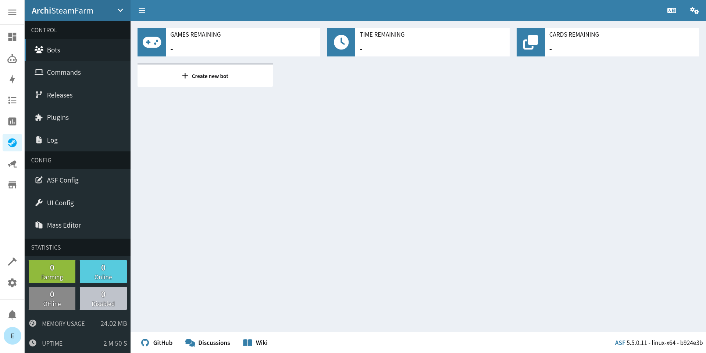

# Home Assistant Add-on: ArchiSteamFarm

## About

[ArchiSteamFarm](https://github.com/JustArchiNET/ArchiSteamFarm/) is a C# application with primary purpose of farming Steam cards from multiple accounts simultaneously.

This add-on installs ArchiSteamFarm on [Home Assistant](https://www.home-assistant.io/addons/) to be used from the sidebar (*ingress*), or as a standalone service (via *host:port*).

## Documentation

Add-on documentation is available [here](/archisteamfarm/DOCS.md).

For information about ASF configuration options, see project [documentation](https://github.com/JustArchiNET/ArchiSteamFarm/wiki).

## Install

